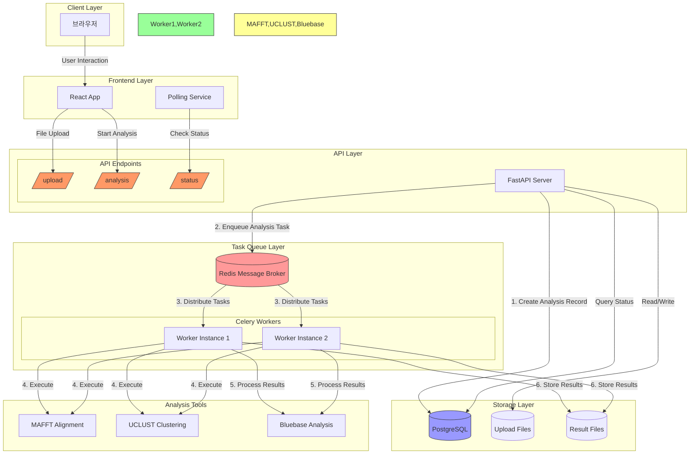

# Sequence Analysis Web Platform

연구자들의 시퀀스 분석 작업을 자동화하는 웹 기반 플랫폼입니다.

## 주요 기능

### 1. 간편한 파일 업로드 및 분석
- 드래그 앤 드롭으로 파일 업로드
- 원하는 분석 도구 선택 (MAFFT/UCLUST)
- 클릭 한 번으로 분석 시작

### 2. 실시간 모니터링
- 분석 진행 상태 실시간 확인
- 오류 발생 시 상세 메시지 제공
- 분석 이력 관리

### 3. 결과 관리
- 분석 결과 시각화
- 통계 데이터 제공
- 모든 결과 파일 ZIP 다운로드

## 시작하기

### 필수 조건
- Docker
- Docker Compose

### 설치 및 실행

1. 저장소 클론

```bash
git clone https://github.com/ampersandor/sequence_alignment.git
cd sequence_alignment
```

2. 환경 변수 설정

```bash
vi frontend/.env
```

3. 컨테이너 실행

```bash
docker-compose up -d
```

4. 웹 플랫폼 접속

```bash
http://localhost:3000
```

## 기술 스택
### Frontend
- React
- TypeScript
- Chakra UI
- Vite

### Backend
- FastAPI
- Celery
- Redis
- PostgreSQL

### Infrastructure
- Docker
- Nginx

## 프로젝트 구조
```
.
├── frontend/ # 프론트엔드 애플리케이션
│ ├── src/ # 소스 코드
│ ├── public/ # 정적 파일
│ └── Dockerfile # 프론트엔드 도커 설정
├── backend/ # 백엔드 애플리케이션
│ ├── app/ # 애플리케이션 코드
│ ├── tests/ # 테스트 코드
│ └── Dockerfile # 백엔드 도커 설정
└── docker-compose.yml # 도커 컴포즈 설정
```

## 개발 환경 설정

### Frontend 개발

```bash
cd frontend
npm install
npm run dev
```
### Backend 개발

```bash
cd backend
pip install -r requirements.txt
uvicorn app.main:app --reload
```

## 배포

1. 프로덕션 빌드

```bash
docker-compose -f docker-compose.prod.yml up -d
```

2. 환경 변수 설정

```bash
cp .env.example .env
```


## 문제 해결

### 일반적인 문제

1. Docker 컨테이너 로그 확인

```bash
docker-compose logs -f
```

2. 특정 서비스 재시작

```bash
docker-compose restart <service-name>
```

## 기여하기

1. Fork the repository
2. Create your feature branch (`git checkout -b feature/AmazingFeature`)
3. Commit your changes (`git commit -m 'Add some AmazingFeature'`)
4. Push to the branch (`git push origin feature/AmazingFeature`)
5. Open a Pull Request

## 라이선스

이 프로젝트는 MIT 라이선스를 따릅니다. 자세한 내용은 [LICENSE](LICENSE) 파일을 참조하세요.

## 작성자

- 이름: [DongHun Kim]
- 이메일: [ddong3525@naver.com]
- GitHub: [https://github.com/ampersandor]

## 감사의 글

이 프로젝트는 연구자들의 업무 효율성 향상을 위해 개발되었습니다.

## 시스템 아키텍처



### 작업 처리 흐름

1. **파일 업로드 & 분석 요청**
   - 사용자가 FASTA 파일을 업로드하고 분석 방법 선택
   - FastAPI가 파일을 저장하고 분석 작업 생성

2. **작업 큐 처리**
   - FastAPI가 Redis에 분석 작업 등록
   - Celery Workers가 Redis로부터 작업 가져와서 처리
   - 분석 도구(MAFFT/UCLUST) 실행 및 결과 처리

3. **상태 관리 & 모니터링**
   - 작업 상태가 PostgreSQL에 저장
   - Frontend가 주기적으로 상태 확인
   - 결과 파일은 볼륨에 저장되고 필요시 다운로드 제공

4. **결과 처리**
   - 분석 완료 후 Bluebase 통계 처리
   - 모든 결과 파일을 ZIP으로 패키징하여 제공